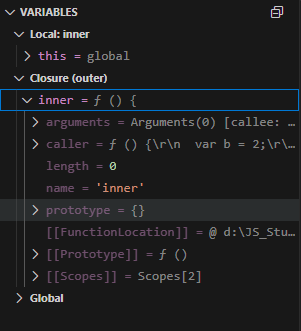
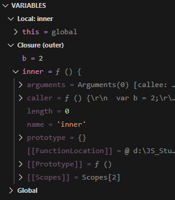
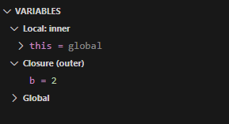

### ex1_01
```
[변수 선언]
- a는 식별자(즉, 변수명)
```

### ex1_02
```
[변수 선언과 할당]
- 변수 a에 데이터 할당
```

### ex1_03
```
[불변성]
- 변수 영역과 데이터 영역 개념
- 값을 변경하면 데이터영역에 있는 기존 값이 변경되는 것이 아니라(기존것 불변), 데이터영역에 별개로 새로운 값이 만들어진다.
```

### ex1_04
```
[참조형 데이터의 할당]
- 기본형 데이터와의 차이는 '객체의 변수(프로퍼티) 영역'이 별도로 존재하며, 그 값들은 불변값으로 동일하게 데이터 영역에 위치함.
```

### ex1_05
```
[참조형 데이터의 프로퍼티 재할당]
```

### ex1_06
```
[중첩된 참조형 데이터(객체)의 프로퍼티 재할당]
- 참조형 데이터의 프로퍼티에 다시 참조형 데이터를 할당 (중첩 객체)
```

### ex1_07
```
[변수 복사]
```

### ex1_08
```
[변수 복사 이후 값 변경 결과 비교(1)]
- 객체의 Property 변경시
- obj2.c를 20으로 바꾸면 동일한 주소를 바라보는 obj1.c도 20으로 변경됨.
```

### ex1_09
```
[변수 복사 이후 값 변경 결과 비교(2)]
- 객체 자체를 변경했을 때
- obj2를 새로 만들었기 때문에 obj1과는 다른 주소를 바라보므로 obj1.c은 그대로 10이 유지됨.
```

### ex1_10
```
[객체의 가변성에 따른 문제점]
- 값으로 전달받은 객체 newUser에 변경을 가하니 user2 뿐만아니라 원본 객체 user가 함께 변함.
```

### ex1_11
```
[객체의 가변성에 따른 문제점의 해결 방법]
- 값으로 전달받은 객체를 변경하는 대신, 새로 객체를 만들어서 Return 하면 원본 객체 user가 변하는 것을 막을 수 있음.
```

### ex1_12
```
[기존 정보를 복사해서 새로운 객체를 반환하는 함수]
- 얕은 복사
```

### ex1_13
```
[CopyObject를 이용한 객체 복사]
- for in 문법을 이용해 result 객체에 target 객체의 Property 복사 (얕은 복사)
```

### ex1_14
```
[중첩된 객체에 대한 얕은 복사]
- urls 내부의 property는 복사가 이루어지지 않고(얕은 복사), user, user2 모두 동일한 주소를 가르키고 있어 하나가 바뀌면 같이 바뀜.
```

### ex1_15
```
[중첩된 객체에 대한 깊은 복사]
- urls 내부의 property는 복사가 이루어지지 않았기 때문에 user2.urls를  copyObject를 활용 추가적으로 복사하면 각각 다른 주소를 가르키게 되어 개별 변경 가능.
```

### ex1_16
```
[객체의 깊은 복사를 수행하는 범용 함수]
- 객체 내부의 property 복사를 재귀적으로 호출하여 깊은 복사 수행하는 함수
```

### ex1_17
```
[깊은 복사 결과 확인]
- copyObjectDeep 함수를 이용하여 깊은 복사는 수행했으나, 객체 obj.b.d는 length 2인 배열(Array)인 반면, 복사된 obj2.b.d는 배열이 아닌 Object로 바뀌었음.
```

### ex1_18
```
[JSON을 활용한 간단한 깊은 복사]
- 객체를 JSON 문법으로 표현된 문자열로 전환했다가 다시 JSON 객체로 바꾸는 복사. 다만, JSON으로 변경할 수 없는 내부 Mothod(function) 등은 복사가 되지 않음.
```

### ex1_19
```
[자동으로 undefined를 부여하는 경우]
- 값을 대입하지 않은 변수에 접근시, 객체 내부에 존재하지 않는 프로퍼티에 접근시, return 문이 없는 함수의 실행 결과시 undefined를 반환함.
```

### ex1_20
```
[undefined와 배열]
- 빈 배열을 만들거나 배열 크기를 할당해도 내부는 비어 있는 배열과 undefined를 할당한 배열의 차이 비교.
```

### ex1_21
```
[빈요소와 배열의 순회]
- '비어있는 요소'는 순회와 관련된 배열 메서드들의 순회 대상에서 제외됨.
```

### ex1_22
```
[undefined와 null의 비교]
- null은 object이고, 사용자는 undefined를 사용하는 대신 null을 사용하라.
```


### ex2_01
```
[실행 컨텍스트와 콜 스택]
- inner 함수에서 a는 외부환경(Outer)에도 정의 되어 있지 않으므로 undefined로 출력되나, outer 함수에서는 a가 외부환경(Global)에 정의되어 있고 1이 Assign 되어 있으므로 1이 출력 됨.
```

### ex2_02
```
[매개변수와 변수에 대한 호이스팅(1)]
- 원본 코드
- 1, undefined, 2가 출력 될 것 같지만, Hoisting에 의해 변수 x는 동일한 1개만 있고, 1, 1, 2가 출력 됨.
```

### ex2_03
```
[매개변수와 변수에 대한 호이스팅(2)]
- 매개변수를 변수 선언/할당과 같다고 간주해서 변환한 상태
- 역시 1, undefined, 2가 출력 될 것 같지만, Hoisting에 의해 변수 x는 동일한 1개만 있고, 1, 1, 2가 출력 됨.
```

### ex2_04
```
[매개변수와 변수에 대한 호이스팅(3)]
- 호이스팅을 마친 상태
- 변수 x는 3번 선언 되었지만 1개만 있고, 1, 1, 2가 출력되는 것이 명확함.
```

### ex2_05
```
[함수 선언의의 호이스팅(1)]
- 원본 코드
- undefined, bbb, function:b가 출력 될 것 같지만, 변수 b 및 함수 b가 Hoisting에 의해 끌어올려져, 실행될 때는 function:b, bbb, bbb가 출력 됨.
```

## ex2_06
```
[함수 선언의의 호이스팅(2)]
- 호이스팅을 마친 상태
- Hoisting을 마치면 변수 b 및 함수 b가 맨위에 있고, 순서대로 실행 되므로 function:b, bbb, bbb가 출력 되는 것이 명확함.
```

## ex2_07
```
[함수 선언의의 호이스팅(3)]
- 함수 선언문을 함수 표현식으로 바꾼 코드
- Hoisting이 끝난 상태에서의 함수 선언문은 함수명으로 선언한 변수에 함수를 할당한 것처럼 여길수 있기 때문에 function:b, bbb, bbb가 출력 되는 것이 명확함.
```

## ex2_08
```
[함수를 정의하는 세가지 방식]
- 함수 선언문으로 선언한 a, 함수 표현식으로 작성한 b, 기명 함수 표현식으로 선언한 C는 보이지만 d는 보이지 않음(ReferenceError: d is not defined).
- a = f a() { }
- b = f() { }
- C = f d() { }
- 다만, C 함수 내부에서 d는 사용 할 수 있음.
```

## ex2_09
```
[함수 선언문과 함수 표현식(1)]
- 원본 코드
- 함수 선언문으로 작성하면 Hoisting시 function까지 끌어 올라오나,
- 함수 표현식으로 작성하면 Hoisting시 var만 끌어 올리고, function은 실행시 Assign 됨.
- 따라서 Hoisting시 multiply는 변수만 잡히고, 아직 function으로 Assign 되지 않았기 때문에 "TypeError:multiply is not a function"이 출력됨.
```

## ex2_10
```
[함수 선언문과 함수 표현식(2)]
- 호이스팅을 마친 상태
- 함수 선언문 sum은 전체를 호이스팅한 반면, 함수 표현식 multiply는 변수 선언부만 호이스팅 함. 
```

## ex2_11
```
[함수 선언문의 위험성]
- 함수 선언문은 전체를 호이스팅하기 때문에, 만약 동일한 함수명으로 아래쪽에 다른 기능으로 다시 정의했다면 앞쪽에 배치함 코드도 다시 정의된 함수로 적용되어 영향을 받는 위험성이 있음. 
```

## ex2_12
```
[상대적으로 함수 표현식이 안전하다]
- 함수 표현식으로 sum을 작성하였으로, 첫줄 sum(3,4) 콘솔 출력은 "TypeError: sum is not a function"로 나오나, a는 3, c는 '1 + 2 = 3'으로 원하는 대로 동작됨. 
```

## ex2_13
```
[스코프 체인]
- outer 함수 안에서는 외부 변수인 a=1이 보이지만, inner 함수 안에서는 한단계 외부인 outer에 a가 없음로 a가 보이지 않고, 내부에서도 아직 a=3이 실행되기 전이므로 내부 a가 Hoisting만 된 상태라 최초 콘솔에는 undefined로 출력됨. 
```

## ex2_14
```
[스코프 체인 확인(1)]
- 크롬 전용 
- outer 함수내에서 b=2를 선언하고 할당했으나, inner 함수에서 b를 사용하지 않으니, 디버그창에서 Closure(outer)에 'inner = f() { }'만 노출되고 'b'는 노출되지 않음.
```


## ex2_15
```
[스코프 체인 확인(2)]
- 크롬 전용 
- inner 함수에서 콘솔로 b를 출력하니, 디버그창에서 Closure(outer)에 'b = 2'가 노출됨.
```


## ex2_16
```
[스코프 체인 확인(3)]
- debugger 이용
- inner 함수에서 콘솔로 b를 출력하니, 디버그창에서 Closure(outer)에 'b = 2'가 노출되나, inner 함수는 내부에서 사용되지 않으니 노출되지 않음.
```



## ex3_01
```
[전역 공간에서 this(브라우저 환경)]
- Node에서 Debugging 시
  {}
  ReferenceError: window is not defined
- 크롬 브라우저 환경에서 Debugging 시
  Window {...}
  Window {...}
  true
```

## ex3_02
```
[전역 공간에서 this(Node.js 환경)]
- {}
- <ref *1> Object [global] { }
- false
```

## ex3_03
```
[전역변수와 전역객체(1)]
- 크롬 브라우저 환경에서 Debugging 시 this === windown
  1
  1
  1
```

## ex3_04
```
[전역변수와 전역객체(2)]
- a, window.a, this.a 모두 동일 객체 window{a: , ...}를 바라봄.
```

## ex3_05
```
[전역변수와 전역객체(3)]
- 전역변수로 선언한 a, b는 지울수 없으나, window.c, window.d로 선언하면 c, d 삭제 가능. 
- Uncaught ReferenceError ReferenceError: c is not defined
- Uncaught ReferenceError ReferenceError: d is not defined
```

## ex3_06
```
[함수로서의 호출, 메서드로서의 호출]
- 함수로 호출하니 this는 Window이고, 메서드로 호출하니 this는 Object 임.
- 함수앞에 점(.)이 있으면(즉, 앞에 객체가 명시되어 있으면) 메서드로 호출한 것이고, 그렇지 않으면 함수로 호출 한 것임.
```

## ex3_07
```
[메서드로서의 호출]
- 점 표기법, 대괄호 표기법
- obj.m(1)과 obj['m'](1)은 표현 방법만 다를뿐 동일함.
```

## ex3_08
```
[메서드 내부에서의 this]
- methodA()가 실행될 때 this는 obj 이고,
- methodB()가 실행될 때 this는 obj.inner 임.
```

## ex3_09
```
[내부 함수에서의 this]
- obj1.outer()에 의해 innerFunc();가 실행될때 비록 outer안에 정의 되어 있으나 호출한 Object가 없으므로 (앞에 점이 없으므로 메서드가 아닌 함수로 호출) 전역에서 호출한 것으로 되어 this는 Window 가 됨.
- obj2.innerMethod()에 의해 innerFunc이 실행될 때는 메서드로 호출하였으며 호출한 Object가 obj2이므로 this는 obj2 가 됨.
```

## ex3_10
```
[내부 함수에서의 this를 우회 하는 방법]
- 내부 함수에서 메서드가 아닌 함수로 호출할 경우 상위 Scope의 this를 상속할 방법이 없지만, this를 변수(self)에 넣어 전달하면 됨.
```

## ex3_11
```
[this를 바인딩하지 않는 함수(화살표 함수)]
- 화살표 함수를 쓰면 실행 컨텍스트를 생성할 때 this 바인딩 과정 자체가 빠지게 되어, 상위 스코프의 this를 그대로 활용 할 수 있음.
```

## ex3_12
```
[콜백 함수 내부에서의 this]
- 함수 A의 제어권을 다른 함수(또는 메서드) B에게 넘겨 주는 경우 함수 A를 콜백 함수라고 함.
- 즉, 함수를 Argument로 넘겨줄 때 그 함수를 Call Back 함수라고 함.
```

## ex3_13
```
[생성자 함수]
- 생성자는 구체적인 인스턴스를 만들기 위한 일종의 틀
- new 명령어와 함께 함수를 호출하면 해당 함수가 생성자로 동작하여 Cat 함수를 호출해서 변수 choco, nabi에 할당함.
```

## ex3_14
```
[call 메서드(1)]
- 함수를 그냥 실행하면 전역객체를 참조하지만 call 메서드를 이용하면 임의의 객체를 this로 지정할 수 있음.
```

## ex3_15
```
[call 메서드(2)]
- 객체의 메서드를 그냥 호출하면 this는 객체를 참조하지만 call 메서드를 이용하면 임의의 객체를 this로 지정할 수 있음.
```

## ex3_16
```
[apply 메서드]
- apply 메서드는 call 메서드와 동일하나, 두번째 인자를 배열로 받음.
```

## ex3_17
```
[call/apply 메서드의 활용(1-1)]
- 유사배열객체에 배열 메서드를 적용.
- push.call()은 배열에 'd'를 추가하고 length를 1 늘렸으며, slice.call()은 obj를 배열로 만들어 복제하여 리턴 함. 
```

## ex3_18
```
[call/apply 메서드의 활용(1-2)]
- arguments, NodeList에 배열 매서드 적용.
```

## ex3_19
```
[call/apply 메서드의 활용(1-3)]
- 문자열에 배열 메서드 적용.
- string은 기본형으로 불변값이므로 push.call()로 추가 할수 없어 Error 발생.
- array의 map.call()은 call back 함수를 인자로 받아 str string의 각 인덱스(a, b, ..)를 인자로 넣어 수행 후 new array로 return 하였고,
- array의 reduce.apply()는 call back 함수를 인자로 받아 수행 후 string은 string으로, 배열은 배열로 변환하여 return 함.
```

## ex3_20
```
[call/apply 메서드의 활용(1-4)]
- ES6의 Array.from 메서드
- 유사배열객체 또는 순회 가능한 모든 종류의 데이터 타입을 배열로 전환
```

## ex3_21
```
[call/apply 메서드의 활용(2)]
- 생성자 내부에서 다른 생성자를 호출
```

## ex3_22
```
[call/apply 메서드의 활용(3-1)]
- 최대/최솟값을 구하는 코드를 직접 구현
```

## ex3_23
```
[call/apply 메서드의 활용(3-2)]
- 여러 인수를 받는 메서드(Math.max/Math.min)에 apply 적용
```

## ex3_24
```
[call/apply 메서드의 활용(3-3)]
- ES6의 펼치기 연산자 활용
```

## ex3_25
```
[bind 메서드]
- this 지정과 부분 적용 함수 구현
```

## ex3_26
```
[bind 메서드]
- name 프로퍼티
```

## ex3_27
```
[내부함수에 this 전달]
- call vs. bind
- 내부함수에서 메서드의 this를 전달하기 위해 call 이나 apply 또는 bind 메서드 활용 가능
```
